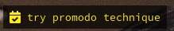

# polybar-warrior
A script to browse through your tasks and mark them as done from Polybar



## Setup

Copy the content of the `font` folder to the path `~/.local/share/fonts`.

Copy/link `task.sh` to your `~/.config/polybar` folder and add the following module to your `config` file:

```ini
[module/taskwarrior]
type = custom/script
exec = ~/.config/polybar-src/modules/task.sh -r 5
tail = true
format = <label>
format-foreground = #fff
format-background = #000
label-padding = 1
label= "%output%"
click-right = kill -USR2 %pid%
click-left = kill -USR1 %pid%
```

## How to use

Interaction with this module is simple:
* Left click: view next task
* Right click: mark current task as done, and the message "Marking as done..." will be displayed for 2 seconds. While the message is there, clicking again will cancel the action.

The module automatically jump to another task every 10 seconds. To change the time between jumps, pass the number of seconds to the script with `-r` switch.
